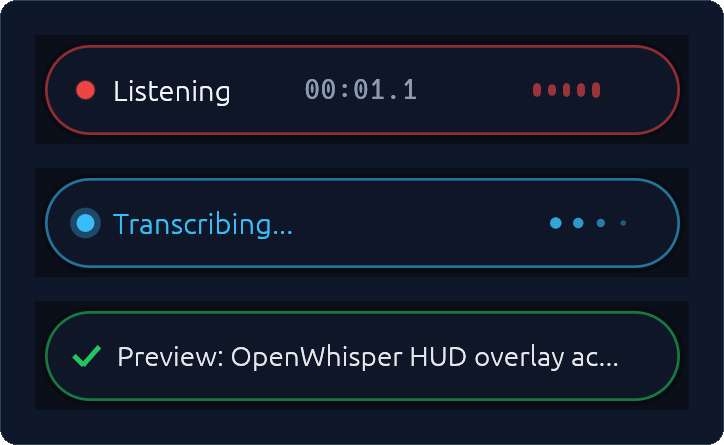

# OpenWhisper 🎙️

[](LICENSE)
[](https://www.rust-lang.org)
[-brightgreen.svg)](#platform-support)
[](#configuration)

A fast, lightweight, privacy-focused speech-to-text dictation assistant written in Rust — inspired by Superwhisper, built natively for **Linux on Wayland**.

Transcriptions are powered by any OpenAI-compatible `/v1/audio/transcriptions` endpoint, including local [OpenVINO Model Server (OVMS)](https://docs.openvino.ai/2026/model-server/ovms_demos_audio.html), Whisper.cpp, vLLM, or cloud OpenAI / Groq providers.

---

## Visual Showcase

### Floating Status HUD
Non-focus-stealing Wayland overlay (`eframe`) with real-time audio VU equalizer, elapsed timer, and smooth state transitions:



### Native System Tray
Wayland StatusNotifierItem (`ksni`) with Breeze-compatible vector SVG icons at native panel resolution:


---

## Key Highlights

- ⚡ **Dual-Mode Hardware Hotkey**: Push-To-Talk (hold $\ge$ 350ms) and hands-free Toggle (tap $<$ 350ms) unified in a single key via direct Linux `evdev` hardware events (`KEY_RIGHTALT` by default). Tap physical `Esc` anytime to instantly abort.
- 🔒 **Zero-Disk In-Memory Audio Pipeline**: Audio captured via `cpal`, resampled in RAM to 16kHz mono with `rubato` bandlimited sinc interpolation (>28 dB stopband attenuation), and encoded to WAV in-memory. Zero temporary files on disk.
- 🎯 **Wayland Virtual Typing & Paste**: Direct kernel-level typing via `/dev/uinput` virtual keyboard, paired with `wl-copy` and `arboard` clipboard fallback.
- 🎙️ **Voice Activity Detection (VAD)**: Real-time RMS silence gating detects when you stop speaking (default: 1800ms) and finalizes transcription automatically.
- 🔊 **Pure In-Memory Earcons**: Mathematically synthesized sine-wave acoustic chimes for start, stop, completion, and cancellation cues.
- 🗄️ **Persistent History & Audio Playback**: Durable SQLite store in WAL mode with instant search, 1-click re-copy, and built-in audio playback.
- ✍️ **Formatting Modes & Vocabulary Biasing**: In-flight casing conversion (`snake_case`, `camelCase`, `kebab-case`, `raw`) and custom technical vocabulary injection.
- 🩺 **Pre-Flight System Diagnostics (`openwhisper doctor`)**: 6-subsystem automated health check inspecting hardware audio, `/dev/uinput`, STT latency, IPC daemon, and desktop integration.

---

## Platform Support

> [!IMPORTANT]
> **Linux on Wayland** is the primary, production-ready, and actively tested platform. Support for other operating systems is planned on our architecture roadmap but is not yet implemented.

| Platform | Status | Architecture & Subsystems |
|---|:---:|---|
| **Linux (Wayland)** | ✅ **Supported & Tested** | Fedora, KDE Plasma 6, GNOME, Sway, Hyprland. Full support via `evdev`, `/dev/uinput`, `cpal` / PipeWire, `ksni` system tray, and `eframe` HUD. |
| **macOS** | 🚧 *Roadmap Goal* | Architecture designed for CoreAudio, `CGEventTap`, and `NSStatusItem`. **Not yet implemented or tested.** |
| **Windows** | 🚧 *Roadmap Goal* | Architecture designed for WASAPI, low-level keyboard hooks, and `SendInput`. **Not yet implemented or tested.** |

See [ROADMAP.md](ROADMAP.md) for planned cross-platform milestones.

---

## Quick Start

### 1. Installation

Clone and install via the automated setup runner:

```bash
git clone https://github.com/michaelwoods/openwhisper.git
cd openwhisper
make install
```

*(Or run `cargo run --release -- setup`)*.

This builds the release binary, installs desktop files and SVG icons, and configures user systemd services (`openwhisper.service` and `openwhisper-ui.service`).

### 2. Pre-Flight Health Check

Verify your audio input, `/dev/uinput` permissions, and STT endpoint:

```bash
openwhisper doctor
```

### 3. Usage

- **Dictate**: Hold **Right Alt** to speak, release to paste (or tap to toggle hands-free).
- **Settings**: Run `openwhisper settings` or right-click the system tray icon.
- **History**: Run `openwhisper history --gui` to search past transcriptions or replay audio.

---

## Configuration

Configuration is stored at `~/.config/openwhisper/config.toml`. Generate the default template anytime:

```bash
openwhisper init-config
```

### Key Settings

```toml
# STT Endpoint (Local OpenVINO Model Server, Whisper.cpp, or OpenAI)
server_url = "http://localhost:8000/v1/audio/transcriptions"
model = "whisper"
# api_key = "sk-..." # Optional bearer token

# Hardware Hotkey (Linux evdev)
evdev_hotkey_enabled = true
evdev_hotkey = "KEY_RIGHTALT" # Options: KEY_RIGHTALT, KEY_RIGHTCTRL, KEY_CAPSLOCK, etc.
ptt_threshold_ms = 350       # Hold >= 350ms for PTT, tap < 350ms for toggle

# Output & Typing
output_mode = "paste"        # "paste" (Ctrl+V into active window) or "type" (uinput keystrokes)
paste_delay_ms = 60

# Floating HUD Overlay
hud_enabled = true
hud_position = "bottom_center" # "bottom_center", "top_center", "bottom_right", "top_right"

# Formatting & Vocabulary
formatting_mode = "standard"   # "standard", "snake_case", "camel_case", "kebab_case", "raw"
vocabulary = ["Rust", "Wayland", "OpenVINO", "cpal", "tokio"]
```

Apply edits in-flight without restarting the daemon:
```bash
openwhisper reload
```

---

## CLI Reference

| Command | Subcommand Alias | Description |
|---|---|---|
| `openwhisper daemon` | | Run background listening daemon |
| `openwhisper ui` | | Run graphical UI service (Tray & HUD overlay) |
| `openwhisper toggle` | | Toggle dictation on/off via IPC |
| `openwhisper ptt-down` | `down`, `press` | Trigger key down (Push-to-Talk) |
| `openwhisper ptt-up` | `up`, `release` | Trigger key up (release to transcribe) |
| `openwhisper cancel` | | Abort current dictation without pasting |
| `openwhisper settings` | `gui`, `config-gui` | Open graphical settings panel |
| `openwhisper history` | `hist` | Query transcription history (`--gui` for standalone viewer) |
| `openwhisper doctor` | `diag` | Run 6-subsystem pre-flight diagnostics (`--json` supported) |
| `openwhisper test-hotkey`| `sniff-keys` | Real-time hardware key sniffer (inspect scancodes & timings) |
| `openwhisper test-ovms` | | Test connectivity and inference latency to STT backend |
| `openwhisper hud-demo` | `hud` | Interactive preview of floating status HUD |
| `openwhisper reload` | `reload-config` | Reload daemon configuration live via IPC |
| `openwhisper setup` | | Automated installer for binaries, icons, and systemd units |

---

## Architecture & Documentation

- 🤖 **[AGENTS.md](AGENTS.md)**: System specification, zero-disk memory constraints, lock-free audio ring buffer invariants, and agent guidelines.
- 🗺️ **[ROADMAP.md](ROADMAP.md)**: Technical design for cross-platform backends (macOS CoreAudio, Windows WASAPI) and real-time streaming STT.
- 📄 **[LICENSE](LICENSE)**: Open-source under the MIT License.


